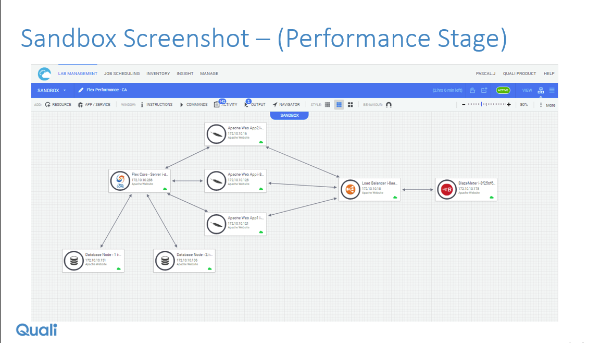

# CloudShell integration with CA Automic Release Automation

Automic Release Automation is a tool for running deployment or testing workflows. 
Automic by itself usually targets a static set of preconfigured PCs. 
This example integration setup shows Automic workflows running against a dynamic and complex environment.

We implemented a Quali action pack for Automic that wraps the Quali sandbox API:

- Login
- Start Sandbox
- Run Test
- Wait for Test
- Stop Sandbox

All are REST actions.

Exported XML representations of the action pack and the workflows are in action-pack-source/ 
and workflow-source/.

The full steps for recreating the action pack by hand are also included below.

A limitation of this implementation:
To work around certificate issues and to simplify programming on the Automic side, the 
Automic actions connect to a relay server that performs additional logic beyond calling the CloudShell API 
(e.g. searching CloudShell API output for patterns, polling for sandbox setup and test completion). 
The source code of this relay is in this repo in sandbox_api_relay.py. For a production action pack release, 
all the logic in the relay would be moved to a native Automic code if possible, so that Automic could communicate
directly with the stock CloudShell API.

We defined a top-level workflow "FlexApp endtoend release" that represents an app release pipeline (playing the 
same role as the Jenkins pipeline).
- Dummy step representing Git checkin
- Dummy step representing Jenkins build
- A series of calls to nested workflows that each represent pipeline stages. A pipeline stage workflow creates a Quali 
sandbox, deploys the app onto the sandbox, runs some test in the sandbox, and tears down the sandbox.
- Dummy steps representing analysis of the results

The top-level workflow is a mockup, but the pipeline stage workflow "Stage 2 - Performance Testing" is live.

"Stage 2 - Performance Testing" calls the Quali custom Automic actions:
- Login
- Start Sandbox
- Run Test, with component regex "Blaze", function name "Start_Traffic". Start_Traffic uses the BlazeMeter API to 
(1) locate a simple URL test matching the name of the resource connected to the BlazeMeter resource, 
(2) update the test URL with the Web Interface attribute of this resource, and (3) start the test. 
Start_Traffic returns immediately with a single string consisting of (BlazeMeter session id (the id of this run), ":", 
and the name of the resource connected to the BlazeMeter resource). It also prints the public URL of the BlazeMeter 
report page to the reservation Output window, so it can be shown immediately at this point.
- Wait For Test, with component regex "Blaze", function name Wait_For_Traffic, session_id_target input set to the 
single string output from the previous step. This will poll the BlazeMeter test run session until the status is completion.
- Stop Sandbox

# Automic overview

Automic workflows are implemented in a graphical flowchart language with "actions" as the building blocks. 
Many "action packs" are available, including from third parties at marketplace.automic.com. 
Most actions are implemented as shell or cmd scripts that require a Unix or Windows host. 
The Automic test drive environment doesn't have execution servers to execute any of these actions. 
Fortunately it is possible to create a REST action. 

Actions are dragged into workflows and connected with flowchart arrows. Workflows can be nested in other workflows.

There are variables at the workflow level that can be defined and set. 

Variables in workflows and actions can be defined with default values, and when the workflow or action is embedded in 
another workflow, some of the variables can be overridden.

Variable names start with "&" and end with "#". If a variable is called &X# and you fill a field with "a &X# b", the 
variable value will be substituted inline. Somewhere in the GUI you may have a choice of different possible times when 
variables should be evaluated. We only used the first way. Don't forget the & or # or use a name that is over about 30 characters. 

The best way to debug Automic is to watch the output of the web proxy. A convenient way to run the proxy is in an xterm in a 
VNC session so that the output is always visible and the terminal session never dies.

The Automic REST-based action mechanism rejects the SSL certificate of https://demo.quali.com:3443. 
Also it is painful or impossible to do complex calculations in Automic. 
So we set up an unencrypted http:// web proxy (Python/Flask). 
The address of this proxy is one of the variables of the workflow and is passed to all Quali action calls. 
The Python source code of the proxy is in the repo. This proxy also implements extra logic such as JSON parsing, 
filtering by name, and polling for completion, beyond the original Quali sandbox APIs. 
This is to avoid implementing any logic in Automic. Our Automic actions make single REST calls to the 
proxy and receive immediately useful strings. Each proxy call can do several calls to https://demo.quali.com:3443, 
perform its own calculations, and wait many minutes to actually return the result to Automic over HTTP.
In particular, the method that runs a function starts the command, polls the server for the command completion status, 
and only then returns the command output. The REST action in Automic is expected to have a long timeout in order to 
avoid crashing while waiting for the command output. Note that the timeout must be set at the top level of the REST action, 
and the two places to "override" the timeout don't work properly.

An action defines certain variables that it can treat as inputs, and expressions can be provided for these variables 
when instantiating the action in a workflow. The expressions can refer to any variables that have been set at that time 
in the workflow. 

An action can use variables whether or not they have been declared in the action, as long as they exist at the time 
they are executed. It's not clear if declaring a variable has any purpose other than documentation or providing a 
default value. We are not necessarily consistent about declaring variables. For example &CLOUDSHELL_TOKEN# is not 
declared in any action but is used in every one except Login. It is expected to have been set earlier in the workflow 
(by calling Login). Other variables are declared but there is no default value to give them, so they are declared only 
to remind the workflow author to set them either at the action call site or in the workflow variables area. 
Other variables are declared but there is no default value to give them.

Actions can also have "prompts" that cause the workflow to pause and pop up a dialog. The REST action places some of 
its inputs in prompts. When running an action by itself in the editor, this dialog is unavoidable, but in a workflow 
it's possible to disable interaction and provide expressions for all the prompts.

All inputs here are taken from variables, not prompts.

Warning: Connect and data timeouts can be entered in 3 places, two of which are called overrides. The overrides don't 
work. Only set the timeouts at the top level of the REST action definition. 

- "Login" logs in to the sandbox API and sets a variable &CLOUDSHELL_TOKEN#. The proxy forwards this request directly 
to https://demo.quali.com:3443 and directly returns the result.

- "Start Sandbox" starts the blueprint of the specified name, using a specified sandbox name, and blocks until Setup 
has finished. Note that the timeout is set to 600 seconds to avoid a timeout. The input variables are &CLOUDSHELL_TOKEN#, 
&CLOUDSHELL_BLUEPRINT_NAME#, &CLOUDSHELL_SANDBOX_NAME#, and also &CLOUDSHELL_CLOUD_PROVIDER# which is a global 
topology input in the example blueprint. It sets &CLOUDSHELL_SANDBOX_ID# and &CLOUDSHELL_SANDBOX_JSON#. 
Theoretically, Automic code will be able to parse the &CLOUDSHELL_SANDBOX_JSON# to get the IPs and credentials of 
all the sandbox resources, and perform custom Automic operations on those resources instead of just on a set of 
statically defined PCs. Unfortunately IPs are not actually implemented in the sandbox API, and it was not possible 
with CloudShell Live to call the TestShell API and get the reservation details, but &CLOUDSHELL_SANDBOX_JSON# is where 
we would put the IPs and credentials eventually.

- "Run Test" and "Wait for Test" both call an arbitrary command, with inputs, on a sandbox component. They have input 
variables &CLOUDSHELL_COMPONENT_REGEX#, &CLOUDSHELL_COMMAND_NAME#, &CLOUDSHELL_SANDBOX_ID#, &CLOUDSHELL_TOKEN#. 
The two actions are identical except that "Wait for Test" saves its outputs in different variable names 
(&CLOUDSHELL_RESULT_CODE2#, &CLOUDSHELL_COMMAND_OUTPUT2# as opposed to &CLOUDSHELL_RESULT_CODE#, &CLOUDSHELL_COMMAND_OUTPUT#), 
which was a quick workaround for some still unexplained malfunctions when calling the same action twice. 
Rather than require a component GUID, the web proxy takes a component name regex and searches all components in the 
reservation by name. 

- "Stop Sandbox" tears down the sandbox. It takes inputs &CLOUDSHELL_TOKEN# and &CLOUDSHELL_SANDBOX_ID#.

Blueprint (zip directory from this repo and drag into portal)

The blueprint assumes a BlazeMeter test has been created with a name matching the resource "Flex Load Balancer" which has a visual connector  to the BlazeMeter app.

 
BlazeMeter is a JMeter-derived SaaS traffic generation service for testing websites. 
You create a test, which can be anything from a Selenium test to a simple GET or POST repeated at a certain frequency. 
In this case we show a simple GET request against a static page to show how we invoke BlazeMeter and expose the 
results page in CloudShell.

BlazeMeter test:

# Creating the Automic action pack

Try to import the zip from action-pack-source. If it works, you can skip the rest of this section. If there are issues, 
you may need to create the action pack manually according to the following steps.

## How to create a REST action
First create an action pack called QUALI_SANDBOX.

Add a new action under it:

Always use no authentication; authentication will be passed in in custom headers: 

Continue to create the action:

## Login action
General:

Request:

Response:

Variables:

Prompt values:

## Start Sandbox action
General:

Web Service timeout:

Request:

Response:

Variables:

Prompt values:

## Run Test action
General:

Web Service timeout:

Request:

Response:

Variables:

Prompt values:

## Wait For Test action
General:

Web Service timeout:

Request:

Response:

Variables:

Prompt values:

## Stop Sandbox
General:

Request:

Response:

Prompt values:

# Creating a sandbox workflow
Create a new workflow called "Stage 2 - Performance Testing"  

Open the workflow.

Add the Login, Start Sandbox, Run Test, Wait For Test, and Stop Sandbox actions, and connect them with arrows:

Set variables at the workflow level:

Set variables for the Run Test action:

Variable settings for the Wait For Traffic action:

